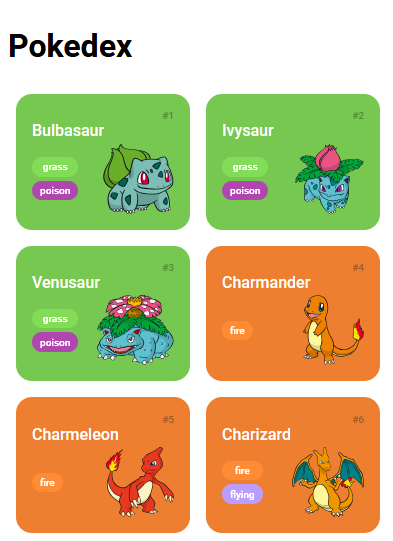
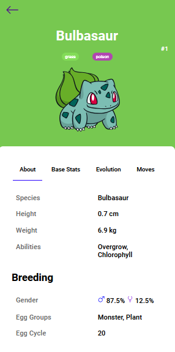

# Pokedex

## :rocket: Descrição do projeto

Desenvolver os detalhes dos pokémons consumindo a API pokeapi. Para tal foram pesquisadas em várias camadas as informações pertinentes, como altura, peso, próximo nível de evolução, ataques do pokémon, vida total e outros. Este projeto faz parte do desafio de código da [DIO](https://dio.me).

## :books: Modificações

- Implementado tela de detalhes com base no design de [Pokedex APP](https://dribbble.com/shots/6540871-Pokedex-App#).

## :speech_balloon: Conheça mais dos meus projetos

Me adicione no Linkedin :point_right: [Leonardo Abdala](https://www.linkedin.com/in/leonardo-abdala/) e no Github, vamos desenvolver juntos. :facepunch:
